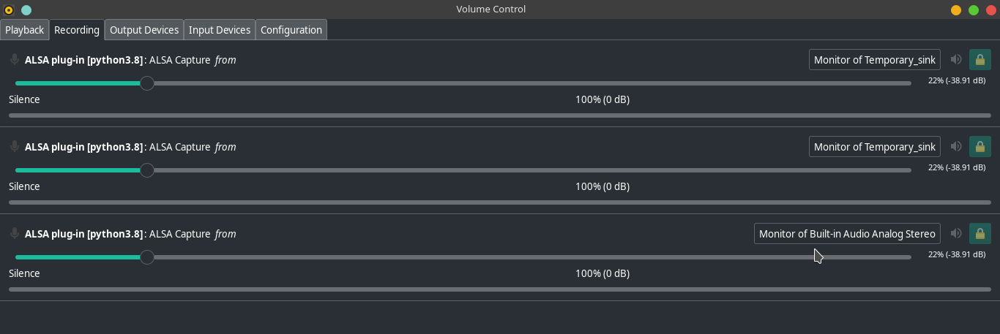
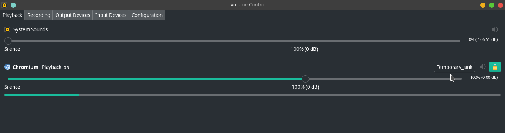
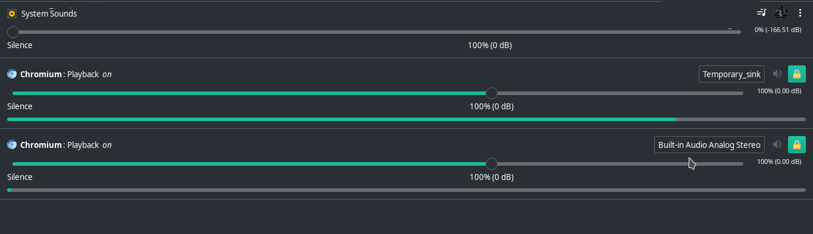

# Meet-Bot

This is a python program that noitifes you whenever your name is being called during a meeting or a call. 

### Installation :- ###

 **C++ Dependencies :-**
   - `Portaudio:`

      1. Download the file from http://www.portaudio.com/archives/pa_stable_v190600_20161030.tgz.
      2. Unzip the file.
      3. Run `./configure` in the root of the extracted folder.
      4. Run `sudo make` in the root folder.
      5. Run `sudo make install` in the root folder.
      6. Run `sudo ldconfig` in the root folder.

 **Python Dependencies :-**
   - `pip install pyaudio`
   - `pip install pydub`
   - `pip install speechrecognition`
   - `pip install wave`
   
 **Pulse Audio :-**
   - Make sure that you have pulse audio already installed in your system (Most Linux Distrubutions already have Pulse Audio installed).
     If not installed, please install it from your package manager :)
     
### Setup and Usage:- ###
  
 **Configuration :-**
   - Run `./configure.sh` and follow the instructions *(You only have to do this once)* .
   - Run `./ruh.sh` to start the program *(Every time you reboot or run `./clearall.sh`)*.
   - You can close the terminal window after this and all the logs will be present in `nohup.txt`.
   - Open Pulse Audio GUI and click on `Recording Tab`.
   - Select the sink for 3 python programs as `Monitor of Temp_sink`.
     
   - Go to `Playback` Tab.
   - Select `Temp_sink` as device for all the applications whose sound you want to monitor.
     
   - Select `Analog Built-in-stereo-output` as device for all the applications whose sound you dont want to monitor and want to listen.
     
   - **Voila**, Now you can listen to music or do some side projects and whenever your name gets called, you'll be **Notified**.
   
 **Footnotes :-**
   - Run `./clearall.sh` to remove all the temporary created files and modules and set everything back to **Normal**.
   - Give all the Bash Scripts **Execute** premission using `sudo chmod +x ./<filename>` where filename is `run.sh`, `configure.sh`, `clearall.sh` *(Avoid < >)*.

**[knightxerons (Manas Dalakoti)](https://github.com/knightxerons)**
<h2>Developers Student Club JIIT 128</h2>
